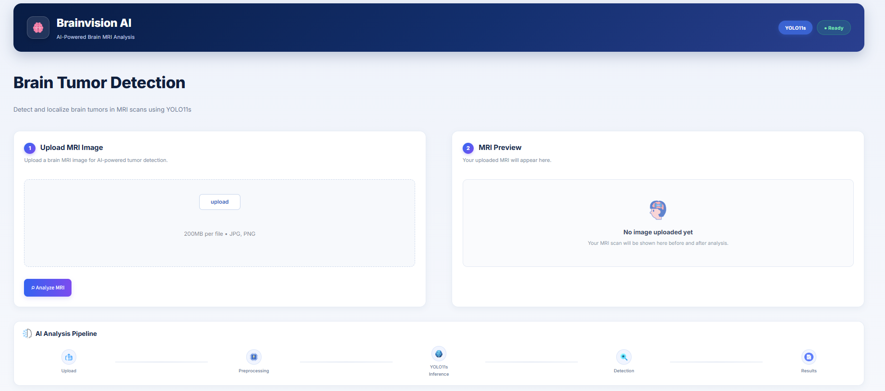
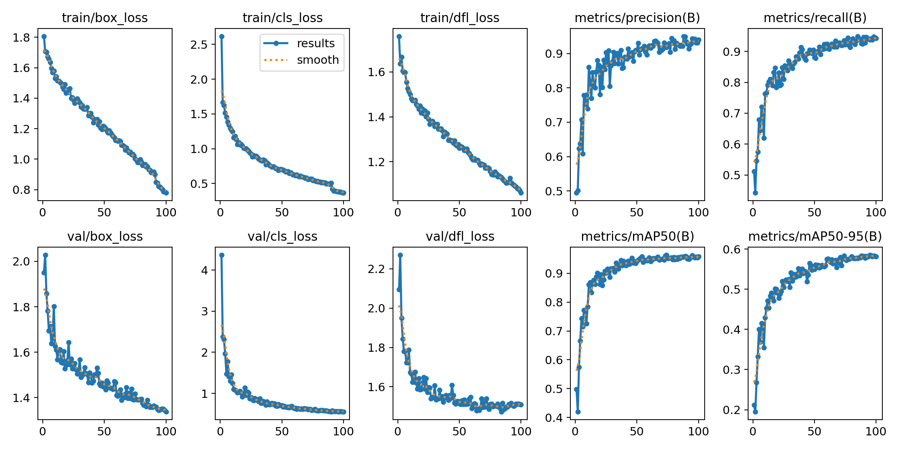
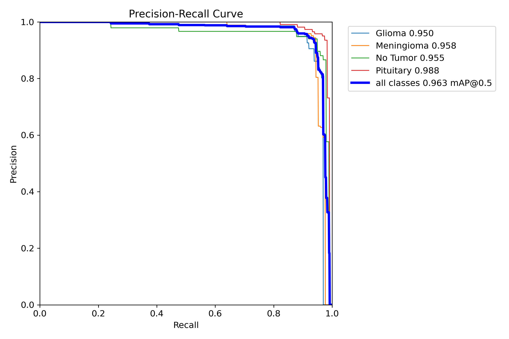
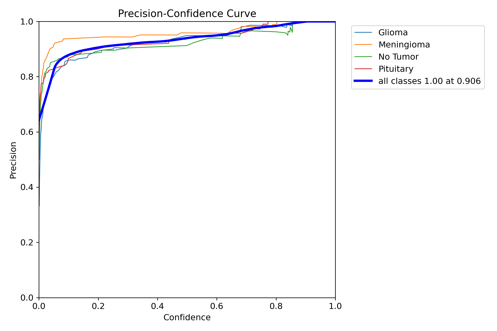
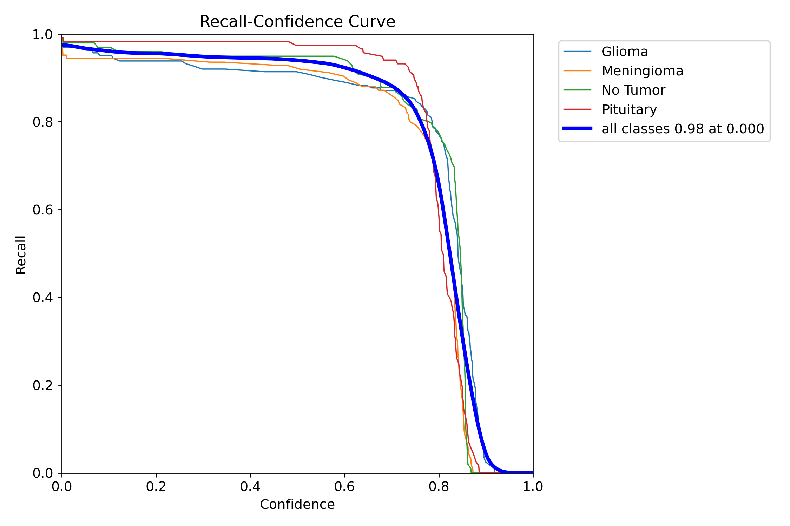
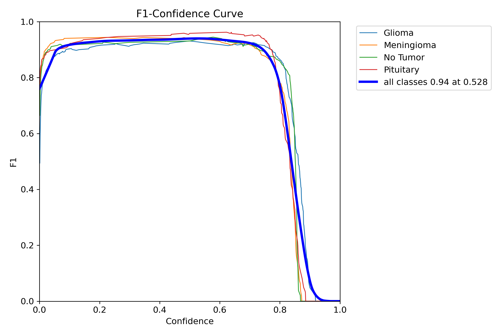
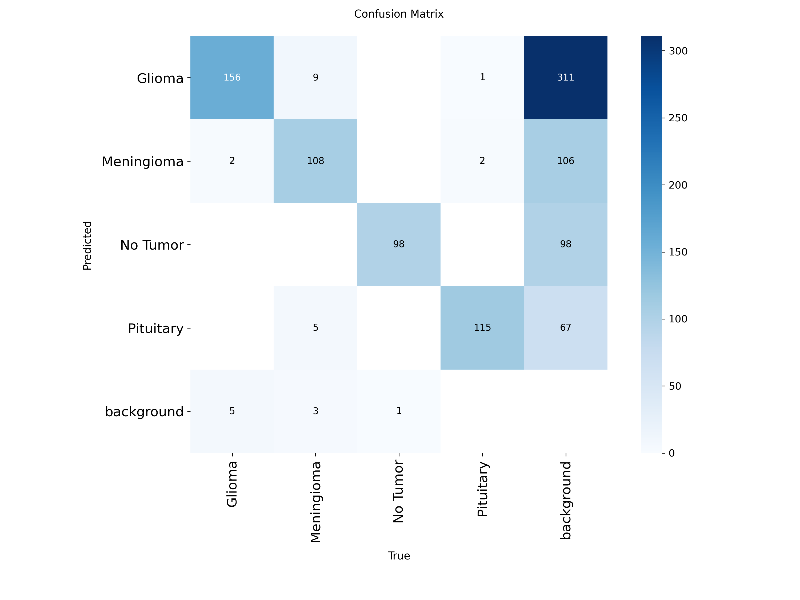
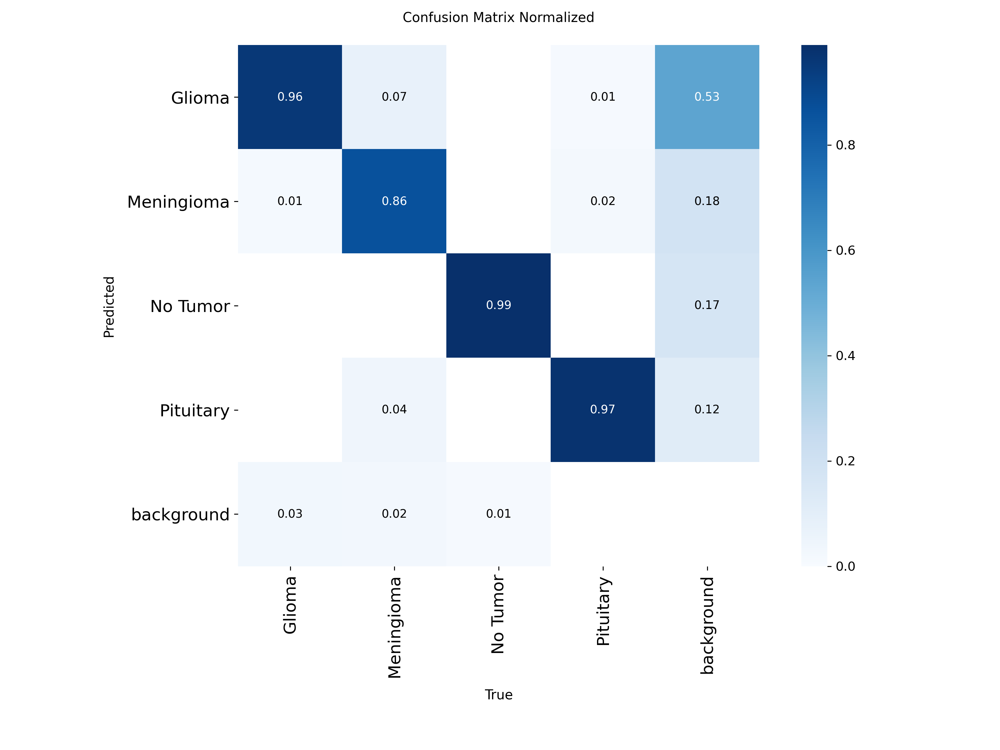
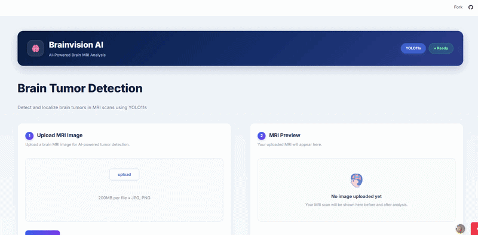

<h1>
  
  BrainVision AI — Brain Tumor Detection
</h1>

An AI-powered web application for detecting and localizing brain tumors in MRI scans using the YOLO11s deep learning model.

BrainVision AI provides an interactive Streamlit interface for MRI image upload, tumor detection and localization, confidence estimation, result visualization, and automatic PDF report generation.

Live Application: [(https://brainvisionai.streamlit.app/)](https://brainvisionai.streamlit.app/)

---

<p align="center">
  
</p>


<h2 align="left">
  <span style="color:#1E3A8A;">Key Features</span>
</h2>

- **MRI Tumor Detection**  
  Detects and localizes brain tumors directly from MRI scans.

- **YOLO11s Inference**  
  Uses YOLO11s deep learning model for tumor detection.

- **Interactive MRI Analysis**  
  Upload, preview, analyze, and visualize MRI scans through a web interface.

- **Confidence Estimation**  
  Displays detection confidence score and detected regions.

- **Visual Results**  
  Provides annotated MRI images with detected tumor locations.

- **PDF Report Generation**  
  Automatically generates downloadable analysis reports.


## Project Structure

```text
Brain-tumor-detection/
│
├── app.py
├── best.pt
├── requirements.txt
├── README.md
│
├── icons/
│   ├── brain.png
│   ├── detection.png
│   ├── github.png
│   ├── header-icon.png
│   ├── mri-preview-icon.png
│   ├── preprocessing.png
│   ├── results.png
│   ├── upload.png
│   └── yolo.png
│
├── images/
│   ├── brainvisionai.PNG
│   └── app-preview.gif
│
└── results/
    ├── BoxF1_curve.png
    ├── BoxP_curve.png
    ├── BoxPR_curve.png
    ├── BoxR_curve.png
    ├── confusion_matrix.png
    ├── confusion_matrix_normalized.png
    ├── labels.jpg
    ├── results.csv
    └── results.png
```


## Technologies Used

- **Python** — Core programming language
- **Streamlit** — Web application framework
- **YOLO11s** — Brain tumor detection and localization
- **PyTorch** — Deep learning framework
- **PIL** — MRI image processing
- **ReportLab** — PDF report generation
- **Git & GitHub** — Version control and project hosting


## Modeling & Evaluation

The system uses the **YOLO11s** object detection model to detect and localize brain tumors in MRI images.


### Model Performance on Test Set

| Metric | Score |
|---|---:|
| Precision | 94.3% |
| Recall | 93.9% |
| mAP@0.50 | 96.0% |
| mAP@0.50:0.95 | 61.4%|


## Results & Visualizations

The following figures summarize the training process and evaluation performance.

### Training Results

<p align="center">
  
</p>


### Evaluation Curves

<p align="center">
  
  &nbsp;&nbsp;&nbsp;
  
</p>

<p align="center">
  
  &nbsp;&nbsp;&nbsp;
  
</p>


### Confusion Matrices

<p align="center">
  
  &nbsp;&nbsp;&nbsp;
  
</p>


## Application Preview
> 🎥 **Note:** Click on the preview GIF to view the complete application demo.
<p align="center">
  
</p>

## Data Source


The dataset used for training and evaluation was obtained from Roboflow Universe and contains labeled brain MRI images for brain tumor detection and localization.

Dataset:  [(https://universe.roboflow.com/mango-qoesz/labeled-mri-brain-tumor-dataset-l8ayj/dataset/1)]

## 👩‍💻 Authors

**Shaghayegh Arzani & Mahshid Helaleh**
